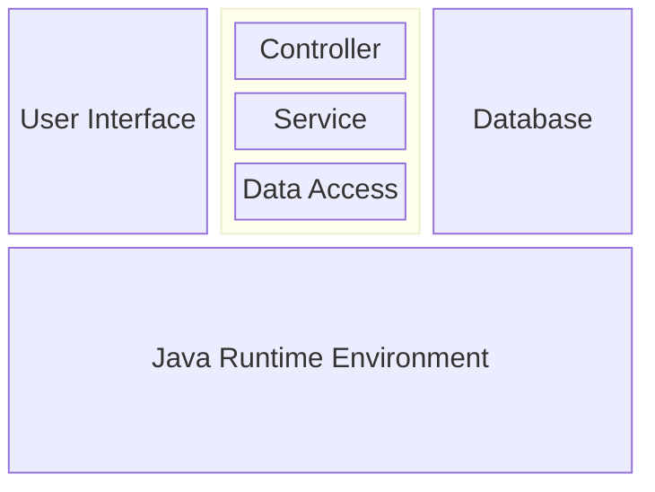

### 1. Architecture Layer Diagram

The application uses a three-tier architecture that runs over the Java Runtime Environment. The architecture consists of the following layers:

1. **User Interface**: Interacts with the user, capturing input and displaying output.

2. **Application**
   + **Controller**: Coordinating between the UI and Service layers.
   + **Service**: Handles the business logic and processing user inputs.
   + **Data Access**: Performs CRUD operations on the text-based in-memory storage and JSON based database

3. **Database**: Handles in-memory storage and data persistence.

4. **Java Runtime Environment**: Provides the runtime environment for the application to execute.

This structure ensures a clear separation of concerns, making the application more modular and maintainable.



### 2. Module Structure

**A. User Interface Layer**

- **MainMenuView.java**:
  - Displays the main menu and handles user input.

- **AccountView.java**:
  - Displays account-related information and handles user interactions for account management.

- **CategoryView.java**:
  - Displays category-related information and handles user interactions for category management.

- **BudgetView.java**:
  - Displays budget-related information and handles user interactions for budget management.

- **TransactionView.java**:
  - Displays transaction-related information and handles user interactions for transaction management.

- **LinkView.java**:
  - Displays link-related information and handles user interactions for linking categories to descriptions.

- **ReportView.java**:
  - Displays financial reports to the user.

**B. Application Layer**

- **MainController.java**:
  - Serves as the main entry point for the application.
  - Manages the user interaction flow and coordinates calls between the View and Service layers.
  - Handles user inputs, calls the appropriate services, and displays results to the user.

- **AccountController.java**:
  - Manages account-related operations and interactions between the view and service layers.

- **CategoryController.java**:
  - Manages category-related operations and interactions between the view and service layers.

- **BudgetController.java**:
  - Manages budget-related operations and interactions between the view and service layers.

- **TransactionController.java**:
  - Manages transaction-related operations and interactions between the view and service layers.

- **LinkController.java**:
  - Manages link-related operations and interactions between the view and service layers.

- **ReportController.java**:
  - Manages report-related operations and interactions between the view and service layers.

**C. Service Layer**

- **AccountService.java**:
  - Contains business logic for account-related use cases.
  - Methods for creating, modifying, viewing, and deleting accounts, incorporating validations.

- **CategoryService.java**:
  - Contains business logic for category management.
  - Methods for creating, modifying, viewing, and deleting categories.

- **BudgetService.java**:
  - Contains logic for budget management.
  - Methods for creating and modifying budgets, including validation for budget amounts.

- **TransactionService.java**:
  - Contains logic for transaction management.
  - Methods for importing and viewing transactions.

- **LinkService.java**:
  - Contains logic for linking categories to descriptions.
  - Methods for creating, modifying, viewing, and deleting links.

- **ReportService.java**:
  - Contains logic for generating financial reports based on transactions and budgets.

**D. Data Layer**
- **AccountDAO.java**:
  - Data Access Object (DAO) for accounts.
  - Methods to create, modify, view, and delete operations on account related operations.

- **CategoryDAO.java**:
  - Data Access Object (DAO) for categories.
  - Methods to create, modify, view, and delete operations on category related operations.

- **BudgetDAO.java**:
  - Data Access Object (DAO) for budgets.
  - Methods to create, modify, view, and delete operations on budget related operations.

- **TransactionDAO.java**:
  - Data Access Object (DAO) for transactions.
  - Methods to create, and view operations on transaction related operations.

- **LinkDAO.java**:
  - Data Access Object (DAO) for links.
  - Methods to create, modify, view, and delete operations on link related operations.

**E. Database Layer**

- **Model.java**:
  - In-memory storage for the application.
  - Stores account, category, budget, transaction, and link data during runtime.

- **Database.java**:
  - JSON-based database for persistent storage.
  - Reads and writes account, category, budget, transaction, and link data to JSON files.


### 3. Suggested Interactions Between Layers

- **User Input Flow**:
  1. The user interacts with the **View Layer** (e.g., `MainMenuView`).
  2. The `ApplicationController` class receives the user input and decides which view or service to call.
  3. Based on the user’s choice, the Controller calls the corresponding **Service Layer** method (e.g., `AccountService`), passing user inputs.
  4. The service layer validates the inputs and interacts with the **Database Layer** (e.g., `AccountDAO`) to perform the necessary CRUD operations.
  5. The result of the database operation (success or failure) is sent back to the service layer, which then returns a message to the `ApplicationController` for display to the user.

### 4. Example Class Interaction for "Create Account" Use Case

1. **User Input**: The user selects account management from the `MainMenuView`.
2. **Controller Layer Handles Flow**: The `ApplicationController` calls `AccountController`.
3. **View Collects Input**: The `AccountController` gets user input via `AccountView`.
4. **Controller Layer Process Request**: `AccountController` then calls `AccountService.createAccount(accountName, accountType)` to process the user request.
5. **Service Layer Validates Input**: `AccountService` checks if the account name is valid and not already in use.
6. **DAO Layer Performs Operation**: If valid, `AccountService` calls `AccountDAO.save(account)`.
7. **Database Layer Writes Data**: `AccountDAO` writes the new account to the text-based database.
8. **Database Layer Returns Result**: The result (success or failure) is returned to `AccountService`.
9. **Service Layer Returns Result**: `AccountService` returns a success message or an error message.
10. **Controller Layer Receives Result**: The message is passed back to `AccountController`.
11. **View Displays Result**: `AccountController` displays the message to the user via `AccountView`.

### 5. Sample Code for the Controller Layer

Here's a basic implementation of the `ApplicationController` class:

```java
// ApplicationController.java
public class ApplicationController {
  private MainMenuView mainMenuView = new MainMenuView();
  private AccountController accountController = new AccountController();

  public void start() {
    while (true) {
      mainMenuView.display();
      int choice = mainMenuView.getUserChoice();
      handleUserChoice(choice);
    }
  }

  private void handleUserChoice(int choice) {
    switch (choice) {
      case 1:
        accountController.createAccount();
        break;
      // Handle other choices...
      case 0: // Exit
        System.out.println("Exiting the application.");
        System.exit(0);
        break;
      default:
        mainMenuView.displayMessage("Invalid choice, please try again.");
    }
  }
}
// AccountController.java
public class AccountController {
  private AccountView accountView = new AccountView();
  private AccountService accountService = new AccountService();

  public void createAccount() {
    String accountName = accountView.getAccountName();
    String accountType = accountView.getAccountType();

    String result = accountService.createAccount(accountName, accountType);
    accountView.displayMessage(result);
  }
}
```